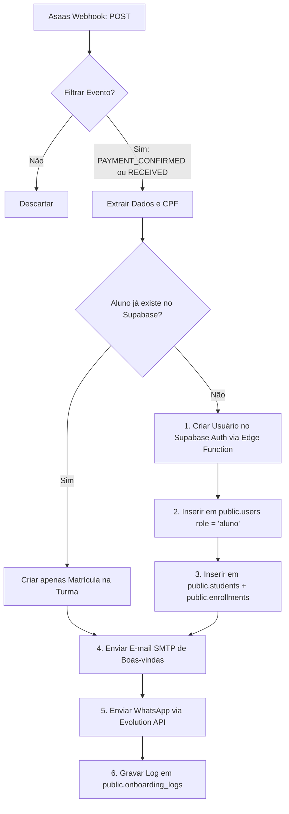

# Configuração do Workflow N8N — Onboarding Pós-Pagamento

Esta documentação descreve as etapas para estruturar o workflow **"CEC - Onboarding Pós-Pagamento"** no seu painel do N8N. Este fluxo é ativado toda vez que o Asaas confirma um pagamento (seja PIX, cartão ou boleto), criando o aluno automaticamente no banco de dados e enviando seus dados de acesso por e-mail e WhatsApp.

---

## 🔗 Endpoint do Webhook
Configure no painel do Asaas a seguinte URL para receber os eventos de pagamento:
`https://webhook.cursocec.com.br/webhook/asaas-payment`

---

## 🚀 Arquitetura do Fluxo no N8N



---

## 🛠️ Detalhes dos Nós (Nodes) do N8N

### 1. Webhook de Entrada
* **Tipo:** Webhook
* **HTTP Method:** `POST`
* **Path:** `/webhook/asaas-payment`
* **Response Mode:** `respondWithCode` (Status `200`)

---

### 2. Filtro de Eventos (IF Node)
Configure o nó condicional para prosseguir apenas se o evento do Asaas indicar pagamento concluído.
* **Condições (AND):**
  * `{{ $json.event }}` **contém** `PAYMENT_RECEIVED`
  * **OR** `{{ $json.event }}` **contém** `PAYMENT_CONFIRMED`

**Exemplo de Payload enviado pelo Asaas:**
```json
{
  "event": "PAYMENT_CONFIRMED",
  "payment": {
    "id": "pay_927391749174",
    "customer": "cus_000005847291",
    "value": 4400.00,
    "billingType": "PIX",
    "status": "CONFIRMED",
    "externalReference": "course_2b7fa8e1-950c-43f1-b9a3-5c8e2289ff12",
    "description": "Matrícula no curso CD-CL"
  }
}
```

---

### 3. Busca de Aluno Existente (Supabase Node)
Realizar uma consulta para evitar a duplicação do aluno.
* **Tabela:** `students`
* **Método:** `GET` (Select)
* **Filtros:**
  * `cpf` **igual a** `{{ $json.payment.customer.cpfCnpj }}` (ou buscar na tabela de `users` pelo e-mail).

---

### 4. Criação de Usuário Auth (Se não existir)
Se o aluno for novo, chame a **Edge Function** do Supabase para criar a conta de autenticação de forma segura, gerando uma senha provisória aleatória.
* **Tipo:** HTTP Request
* **URL:** `https://xhttwdrxnrbtjbchihji.supabase.co/functions/v1/admin-create-user` (Substituir pela URL ativa do Supabase)
* **Method:** `POST`
* **Headers:**
  * `Authorization`: `Bearer {{ CHAVE_SERVICE_ROLE_DO_SUPABASE }}`
  * `Content-Type`: `application/json`
* **Body (JSON):**
  ```json
  {
    "action": "create",
    "email": "{{ $node.Webhook.json.payment.customer.email }}",
    "password": "CEC@{{ Math.floor(100000 + Math.random() * 900000) }}",
    "fullName": "{{ $node.Webhook.json.payment.customer.name }}",
    "phone": "{{ $node.Webhook.json.payment.customer.mobilePhone }}",
    "role": "aluno"
  }
  ```

---

### 5. Inserção de Dados Cadastrais (Supabase)
Com o `userId` retornado pela Edge Function, o N8N deve inserir os registros em ordem:
1. **Tabela `public.users`:**
   ```sql
   INSERT INTO public.users (id, full_name, email, phone, role)
   VALUES ('{{ $json.userId }}', '{{ nome }}', '{{ email }}', '{{ telefone }}', 'aluno');
   ```
2. **Tabela `public.students`:**
   ```sql
   INSERT INTO public.students (id, user_id, full_name, cpf, email, phone)
   VALUES (gen_random_uuid(), '{{ $json.userId }}', '{{ nome }}', '{{ cpf }}', '{{ email }}', '{{ telefone }}');
   ```
3. **Tabela `public.enrollments`:**
   ```sql
   INSERT INTO public.enrollments (student_id, course_name, status, payment_method, asaas_payment_id)
   VALUES ('{{ studentId }}', '{{ curso }}', 'ativa', '{{ billingType }}', '{{ paymentId }}');
   ```

---

### 6. Envio das Credenciais por E-mail (SMTP Node)
* **Assunto:** `Seu acesso à plataforma C&C Engenharia está liberado! 🎓`
* **Corpo (HTML):**
  ```html
  <p>Olá, <strong>{{ nome }}</strong>!</p>
  <p>Sua matrícula foi confirmada com sucesso. Aqui estão os seus dados de acesso para a nossa plataforma de estudos:</p>
  <div style="background: #f1f5f9; padding: 15px; border-radius: 8px; font-family: monospace;">
    <strong>Link de Acesso:</strong> <a href="https://cursocec.com.br/login">cursocec.com.br/login</a><br/>
    <strong>E-mail de Login:</strong> {{ email }}<br/>
    <strong>Senha Provisória:</strong> {{ senha }}
  </div>
  <p>Recomendamos que você altere sua senha no seu primeiro acesso.</p>
  ```

---

### 7. Envio por WhatsApp (Evolution API / Evolution Node)
* **Method:** `POST`
* **URL:** `https://sua-evolution-api.com/message/sendText/sua-instancia`
* **Body:**
  ```json
  {
    "number": "55{{ telefone }}",
    "text": "Olá {{ nome }}! Sua matrícula na C&C Engenharia foi confirmada.\n\n💻 Acesse: cursocec.com.br/login\n📧 Login: {{ email }}\n🔑 Senha provisória: {{ senha }}\n\nBons estudos!"
  }
  ```

---

### 8. Registro de Log de Auditoria
Ao final, grave o resultado da execução na tabela `onboarding_logs` para fins de suporte:
```sql
INSERT INTO public.onboarding_logs (
  student_id,
  asaas_payment_id,
  asaas_customer_id,
  payment_value,
  payment_method,
  email_sent,
  whatsapp_sent,
  credentials_login
) VALUES (
  '{{ studentId }}',
  '{{ paymentId }}',
  '{{ customerId }}',
  {{ valor }},
  '{{ billingType }}',
  true,
  true,
  '{{ email }}'
);
```

---

## 9. Registro Financeiro Interno
Toda cobrança recebida no webhook deve gerar o lançamento de receita correspondente na tabela `financial_records`:
```sql
INSERT INTO public.financial_records (
  student_id,
  course_id,
  type,
  category,
  amount,
  payment_method,
  asaas_payment_id,
  status,
  description,
  date
) VALUES (
  '{{ studentId }}',
  '{{ courseId }}',
  'receita',
  'matricula',
  {{ valor }},
  '{{ billingType }}',
  '{{ paymentId }}',
  'confirmado',
  'Matrícula online confirmada via Asaas',
  NOW()
);
```

